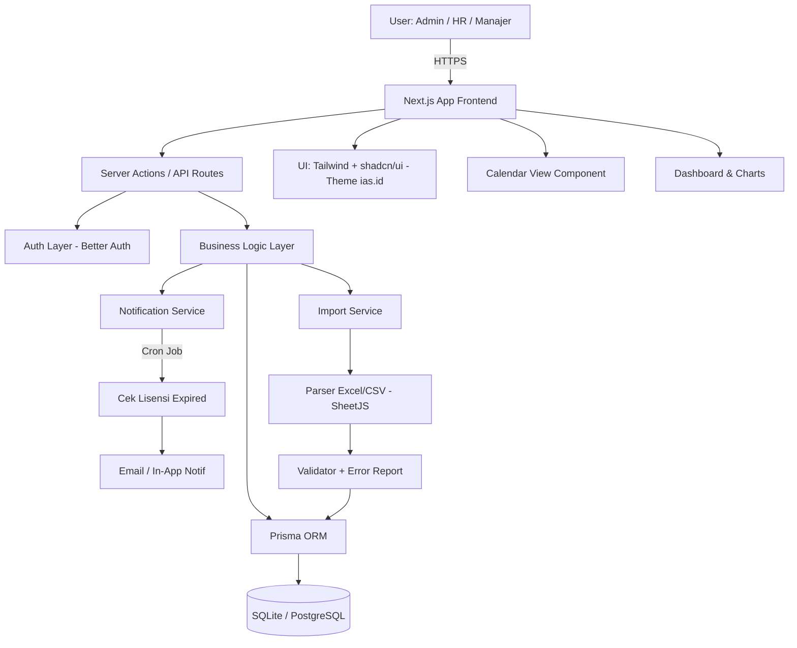
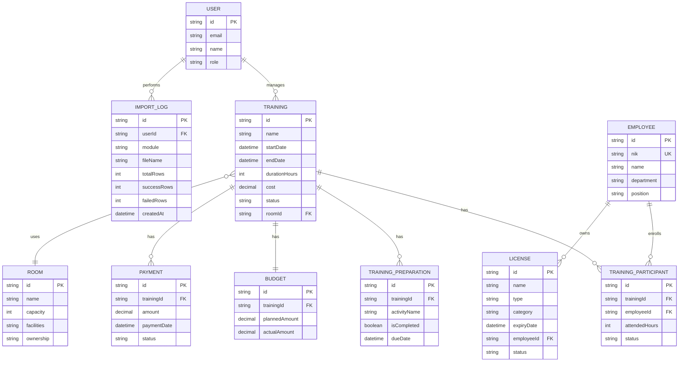

# PRD — Project Requirements Document

## 1. Overview

**LENTERA** (Learning, Evaluation, Needs, Training & Employee Reporting Application) adalah aplikasi web internal perusahaan yang dirancang untuk memonitor dan mengelola seluruh kegiatan training karyawan serta lisensi/sertifikasi yang dimiliki perusahaan secara terpusat.

**Masalah yang diselesaikan:**
- Pencatatan training karyawan masih tersebar (Excel, email, dokumen manual) sehingga sulit dimonitor.
- Tidak ada sistem peringatan dini untuk lisensi/sertifikasi yang akan habis masa berlakunya.
- Anggaran dan pembayaran training sulit dilacak realisasinya.
- Penggunaan ruangan training sering bentrok karena tidak ada sistem booking terpusat.
- Migrasi data historis dari Excel ke aplikasi baru memakan waktu jika harus input manual satu per satu.

**Tujuan utama:**
- Menyediakan satu dashboard terpusat untuk admin memonitor semua training (persiapan, berlangsung, selesai).
- Memastikan tidak ada lisensi perusahaan/karyawan yang expired tanpa terdeteksi.
- Mempermudah perencanaan anggaran dan pelacakan pembayaran training.
- Mengoptimalkan utilisasi ruangan training.
- Mendukung **import data massal** via Excel/CSV agar migrasi & input rutin lebih cepat.

---

## 2. Requirements

- Aplikasi berbasis web yang dapat diakses internal perusahaan.
- Sistem autentikasi dengan role-based access (Admin, HR, Manajer).
- Mendukung input data karyawan berdasarkan **NIK** sebagai identitas unik.
- Sistem notifikasi otomatis untuk lisensi yang mendekati masa kadaluarsa.
- Calendar view untuk melihat jadwal training secara visual.
- Dashboard yang menampilkan ringkasan training, anggaran, lisensi, dan ruangan.
- **Fitur Import Data (Excel/CSV)** tersedia di setiap menu utama dengan template yang dapat diunduh.
- Pelaporan/export data ke format umum (PDF/Excel) untuk dokumentasi.
- Database relasional yang terstruktur dan scalable menggunakan Prisma ORM.
- UI yang clean, modern, dan professional mengadopsi gaya **corporate aviation** (referensi: ias.id).

---

## 3. Core Features

- **Dashboard Admin** — ringkasan training berjalan, lisensi hampir expired, status anggaran, dan utilisasi ruangan.
- **Manajemen Training** — input data training (nama, instruktur, durasi, biaya, ruangan, jadwal) beserta rincian aktivitas persiapan (identifikasi kebutuhan, pemilihan instruktur, pemesanan tempat).
- **Calendar of Training** — visualisasi jadwal training dalam tampilan kalender bulanan/mingguan.
- **Registrasi Peserta** — input peserta training berdasarkan NIK karyawan, alokasi jam training per peserta.
- **Monitoring Lisensi** — pencatatan jenis lisensi (perusahaan/individu), masa berlaku, dan notifikasi otomatis.
- **Monitoring Anggaran & Pembayaran** — pencatatan budget per training, realisasi pembayaran, status (lunas/jatuh tempo/belum dibayar).
- **Manajemen Ruangan** — daftar ruangan dengan kapasitas, fasilitas, kepemilikan, dan ketersediaan jadwal.
- **Import Data Massal** — fitur import Excel/CSV di setiap menu utama:
  - Import data **Karyawan** (NIK, nama, departemen, posisi, email).
  - Import data **Training** (nama, instruktur, jadwal, biaya, ruangan).
  - Import data **Peserta Training** (training, NIK karyawan, jam training).
  - Import data **Lisensi** (nama, jenis, kategori, tanggal terbit, tanggal expired, pemilik).
  - Import data **Anggaran & Pembayaran** (training, planned amount, actual, status).
  - Import data **Ruangan** (nama, kapasitas, fasilitas, kepemilikan, lokasi).
  - Setiap menu menyediakan **template Excel** yang dapat diunduh.
  - **Validasi otomatis** (cek duplikasi NIK, format tanggal, FK valid) sebelum data masuk.
  - **Error report** menampilkan baris yang gagal beserta alasannya, dan baris valid tetap diproses.
- **Laporan & Export** — ringkasan training periode tertentu yang dapat diunduh.

---

## 4. User Flow

1. Admin/HR login ke aplikasi LENTERA.
2. Admin masuk ke **Dashboard** untuk melihat ringkasan semua aktivitas.
3. **(Opsional) Import data awal** — pada setiap menu, admin dapat:
   - Mengunduh template Excel.
   - Mengisi template sesuai format.
   - Mengunggah file untuk diproses sistem.
   - Melihat preview & error report sebelum konfirmasi.
4. Admin membuat **Training baru**:
   - Mengisi data dasar (nama, tanggal, durasi, biaya).
   - Memilih **ruangan** dari daftar yang tersedia.
   - Membuat checklist **aktivitas persiapan** (identifikasi kebutuhan, instruktur, dll).
   - Menentukan **anggaran** training.
5. Admin melakukan **registrasi peserta** dengan input NIK karyawan dan jam training (manual atau import Excel).
6. Selama training berjalan, admin mencatat **pembayaran** yang dilakukan.
7. Admin secara berkala mengecek **Monitoring Lisensi** dan menerima notifikasi lisensi yang akan expired.
8. Admin melihat **Calendar of Training** untuk memastikan tidak ada jadwal yang bentrok.
9. Setelah training selesai, admin menandai status training sebagai *completed* dan mengunduh laporan.

---

## 5. Design System & Branding

Style visual aplikasi LENTERA mengadopsi tampilan **corporate professional** seperti website **ias.id** (PT Integrasi Aviasi Solusi) — bersih, modern, dan memberi kesan terpercaya khas korporat aviasi.

### 🎨 Palet Warna Utama

| Token | Hex | Penggunaan |
|---|---|---|
| **Primary / Navy** | `#0B2A4A` | Background sidebar, header, tombol utama, judul section |
| **Primary Dark** | `#061A2E` | Hover state navy, footer |
| **Accent / Sky Blue** | `#1E88E5` | Tombol aksi sekunder, link, highlight, ikon aktif |
| **Accent Light** | `#64B5F6` | Hover state biru, badge informasi |
| **Background** | `#F5F7FA` | Background utama halaman |
| **Surface / Card** | `#FFFFFF` | Kartu, modal, form container |
| **Border / Divider** | `#E0E6ED` | Garis pemisah, border input |
| **Text Primary** | `#1A2332` | Teks utama, heading |
| **Text Secondary** | `#5A6B7C` | Teks pendukung, label, placeholder |
| **Success** | `#2E7D32` | Status lunas, training selesai, lisensi aktif |
| **Warning** | `#F9A825` | Lisensi mendekati expired, pembayaran pending |
| **Danger** | `#C62828` | Lisensi expired, pembayaran overdue, error |

### 🖋️ Typography
- **Font Family:** `Inter` atau `Plus Jakarta Sans` (Google Fonts) — modern sans-serif, mudah dibaca.
- **Heading:** Bold, warna Navy (`#0B2A4A`).
- **Body:** Regular 14–16px, warna Text Primary.
- **Hierarchy jelas:** H1 (28px) → H2 (22px) → H3 (18px) → Body (14–16px).

### 🧩 Komponen UI
- **Sidebar:** Background Navy (`#0B2A4A`), ikon & teks putih, active state Sky Blue.
- **Header / Topbar:** Background putih, border bawah tipis, logo LENTERA di kiri, profil user di kanan.
- **Card:** Background putih, border `#E0E6ED`, shadow halus (`shadow-sm`), border-radius 8–12px.
- **Tombol Primary:** Background Navy, teks putih, hover → Primary Dark.
- **Tombol Secondary:** Outline Sky Blue, teks Sky Blue, hover → background Sky Blue + teks putih.
- **Input/Form:** Border tipis `#E0E6ED`, focus ring Sky Blue.
- **Badge Status:** Pakai warna semantik (Success/Warning/Danger) dengan background pucat & teks gelap.
- **Tabel:** Header background `#F5F7FA`, baris hover `#F0F4F8`, garis pemisah halus.
- **Chart (Recharts):** Skema warna Navy + Sky Blue + Accent Light + Success/Warning untuk kontras.

### 🎯 Prinsip Desain
- **Clean & spacious** — banyak white space, hindari elemen padat.
- **Professional** — minim dekorasi, fokus pada keterbacaan data.
- **Consistent** — semua tombol, card, dan form mengikuti token warna yang sama.
- **Accessible** — kontras teks vs background memenuhi WCAG AA.

> Konfigurasi warna di-implementasikan via **Tailwind CSS theme extension** (`tailwind.config.ts`) dan **shadcn/ui CSS variables** agar konsisten di seluruh aplikasi serta mendukung dark mode di masa depan.

---

## 6. Architecture

Aplikasi menggunakan arsitektur **monolith full-stack** dengan Next.js (App Router) sebagai frontend sekaligus backend (API Routes/Server Actions), dan Prisma sebagai jembatan ke database.

**Penjelasan singkat:**
- **Frontend & Backend** berada dalam satu codebase Next.js.
- **Prisma ORM** menangani semua interaksi database secara type-safe.
- **Notification Service** berjalan via cron job untuk memeriksa lisensi yang akan expired dan mengirim notifikasi.
- **Import Service** memproses file Excel/CSV via SheetJS, melakukan validasi per baris, lalu meneruskan data valid ke Prisma. Baris gagal dikembalikan sebagai error report.
- **Better Auth** menangani autentikasi dan otorisasi berbasis role.
- **UI Theme** mengikuti design system bergaya ias.id (navy + sky blue corporate).

---

## 7. Database Schema

Berikut tabel utama yang dibutuhkan beserta kolomnya:

### `User` — pengguna aplikasi (admin/HR)
- `id` (String, PK)
- `email` (String, unik)
- `name` (String)
- `password` (String, hashed)
- `role` (Enum: ADMIN, HR, MANAGER)
- `createdAt` (DateTime)

### `Employee` — karyawan perusahaan
- `id` (String, PK)
- `nik` (String, unik) — identitas utama karyawan
- `name` (String)
- `department` (String)
- `position` (String)
- `email` (String)

### `Training` — data training
- `id` (String, PK)
- `name` (String) — nama training
- `description` (Text)
- `instructor` (String)
- `startDate`, `endDate` (DateTime)
- `durationHours` (Int)
- `cost` (Decimal) — biaya training
- `status` (Enum: PLANNING, ONGOING, COMPLETED, CANCELLED)
- `roomId` (FK → Room)

### `TrainingPreparation` — checklist persiapan training
- `id` (String, PK)
- `trainingId` (FK → Training)
- `activityName` (String) — mis. "Pemilihan Instruktur"
- `isCompleted` (Boolean)
- `dueDate` (DateTime)
- `notes` (Text)

### `TrainingParticipant` — peserta training
- `id` (String, PK)
- `trainingId` (FK → Training)
- `employeeId` (FK → Employee)
- `attendedHours` (Int) — jam training yang diikuti
- `status` (Enum: REGISTERED, ATTENDED, ABSENT)

### `License` — lisensi/sertifikasi
- `id` (String, PK)
- `name` (String) — nama lisensi
- `type` (Enum: COMPANY, INDIVIDUAL)
- `category` (String) — jenis lisensi (mis. K3, ISO, Sertifikasi Profesi)
- `issuedDate`, `expiryDate` (DateTime)
- `employeeId` (FK → Employee, nullable jika lisensi perusahaan)
- `status` (Enum: ACTIVE, EXPIRING_SOON, EXPIRED)

### `Budget` — anggaran training
- `id` (String, PK)
- `trainingId` (FK → Training)
- `plannedAmount` (Decimal)
- `actualAmount` (Decimal)
- `notes` (Text)

### `Payment` — pembayaran training
- `id` (String, PK)
- `trainingId` (FK → Training)
- `amount` (Decimal)
- `paymentDate` (DateTime)
- `dueDate` (DateTime)
- `status` (Enum: PAID, PENDING, OVERDUE)
- `description` (String)

### `Room` — data ruangan
- `id` (String, PK)
- `name` (String)
- `capacity` (Int)
- `facilities` (Text) — mis. proyektor, AC, whiteboard
- `ownership` (Enum: INTERNAL, RENTED)
- `location` (String)

### `ImportLog` — riwayat import data
- `id` (String, PK)
- `userId` (FK → User) — yang melakukan import
- `module` (Enum: EMPLOYEE, TRAINING, PARTICIPANT, LICENSE, BUDGET, PAYMENT, ROOM)
- `fileName` (String)
- `totalRows` (Int)
- `successRows` (Int)
- `failedRows` (Int)
- `errorReport` (Text/JSON) — detail baris yang gagal
- `createdAt` (DateTime)

---

## 8. Tech Stack

| Kategori | Teknologi | Alasan |
|---|---|---|
| **Framework** | Next.js (App Router) | Full-stack React framework, SSR, server actions |
| **Styling** | Tailwind CSS (custom theme ias.id) | Utility-first CSS dengan token warna corporate navy + sky blue |
| **UI Components** | shadcn/ui | Komponen modern, accessible, mudah dikustomisasi sesuai brand |
| **Font** | Inter / Plus Jakarta Sans | Modern sans-serif untuk tampilan profesional |
| **ORM** | **Prisma** | Type-safe ORM, migration mudah, sesuai permintaan |
| **Database** | PostgreSQL (production) / SQLite (development) | Relasional, scalable, didukung penuh Prisma |
| **Authentication** | Better Auth | Auth modern dengan dukungan role-based access |
| **Calendar UI** | FullCalendar / react-big-calendar | Komponen kalender siap pakai untuk jadwal training |
| **Charts** | Recharts | Visualisasi data anggaran & ringkasan dashboard (skema navy + sky blue) |
| **Notifikasi** | Resend / Nodemailer + Cron (node-cron) | Pengingat lisensi expired via email |
| **Import Excel/CSV** | **SheetJS (xlsx) + Zod** | Parsing file Excel/CSV + validasi skema per baris |
| **Deployment** | Vercel / Self-hosted (Docker) | Sesuaikan kebutuhan internal perusahaan |
| **Export** | jsPDF + xlsx | Generate laporan PDF dan Excel |