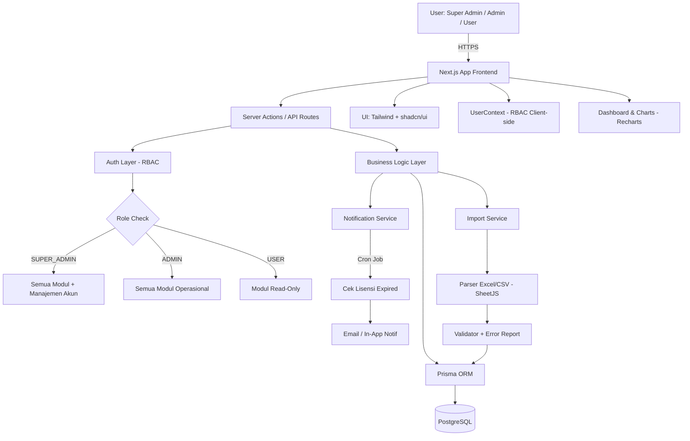
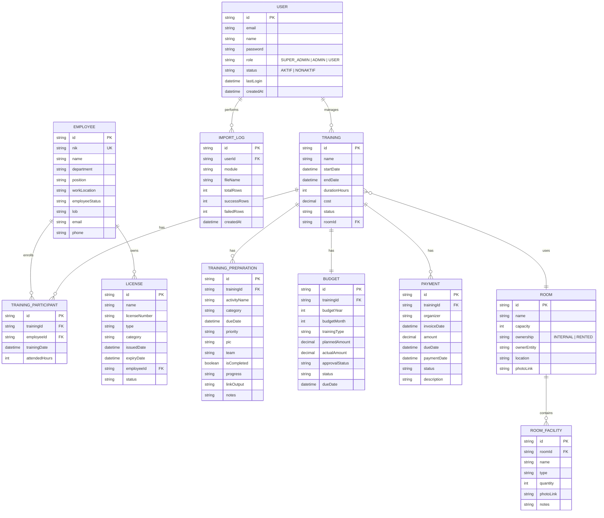

# PRD — Project Requirements Document

## 1. Overview

**LENTERA** (Learning, Evaluation, Needs, Training & Employee Reporting Application) adalah aplikasi web internal perusahaan yang dirancang untuk memonitor dan mengelola seluruh kegiatan training karyawan serta lisensi/sertifikasi yang dimiliki perusahaan secara terpusat.

**Masalah yang diselesaikan:**
- Pencatatan training karyawan masih tersebar (Excel, email, dokumen manual) sehingga sulit dimonitor.
- Tidak ada sistem peringatan dini untuk lisensi/sertifikasi yang akan habis masa berlakunya.
- Anggaran dan pembayaran training sulit dilacak realisasinya.
- Penggunaan ruangan training sering bentrok karena tidak ada sistem booking terpusat.
- Migrasi data historis dari Excel ke aplikasi baru memakan waktu jika harus input manual satu per satu.
- Tidak ada kontrol akses berbasis peran yang memisahkan tanggung jawab pengelolaan sistem.

**Tujuan utama:**
- Menyediakan satu dashboard terpusat untuk admin memonitor semua training (persiapan, berlangsung, selesai).
- Memastikan tidak ada lisensi perusahaan/karyawan yang expired tanpa terdeteksi.
- Mempermudah perencanaan anggaran dan pelacakan pembayaran training.
- Mengoptimalkan utilisasi ruangan training.
- Mendukung **import data massal** via Excel/CSV agar migrasi & input rutin lebih cepat.
- Menerapkan **Role-Based Access Control (RBAC)** yang ketat dengan tiga tingkatan akses.

---

## 2. Requirements

- Aplikasi berbasis web yang dapat diakses internal perusahaan.
- Sistem autentikasi dengan **role-based access** tiga tingkatan: **Super Admin**, **Admin**, dan **User**.
- Mendukung input data karyawan berdasarkan **NIK** sebagai identitas unik.
- Sistem notifikasi otomatis untuk lisensi yang mendekati masa kadaluarsa.
- Calendar view untuk melihat jadwal training secara visual.
- Dashboard yang menampilkan ringkasan training, anggaran, lisensi, dan ruangan.
- **Fitur Import Data (Excel/CSV)** tersedia di setiap menu utama dengan template yang dapat diunduh.
- Pelaporan/export data ke format umum (PDF/Excel) untuk dokumentasi.
- Database relasional yang terstruktur dan scalable menggunakan Prisma ORM.
- UI yang clean, modern, dan professional mengadopsi gaya **corporate aviation** (referensi: ias.id).

---

## 3. Role & Hak Akses

Sistem menggunakan tiga tingkatan peran pengguna dengan hak akses berbeda:

| Fitur | Super Admin | Admin | User |
|---|:---:|:---:|:---:|
| Dashboard | ✅ | ✅ | ✅ |
| Manajemen Training | ✅ | ✅ | ✅ (read) |
| Kalender Training | ✅ | ✅ | ✅ |
| Learning Hours | ✅ | ✅ | ✅ |
| Lisensi & Sertifikasi | ✅ | ✅ | ✅ (read) |
| Manajemen Karyawan | ✅ | ✅ | ❌ |
| Anggaran & Biaya | ✅ | ✅ | ❌ |
| Manajemen Ruangan | ✅ | ✅ | ✅ (read) |
| Pengaturan | ✅ | ✅ | ❌ |
| **Manajemen Akun** | ✅ | ❌ | ❌ |

- **Super Admin** — akses penuh ke semua modul termasuk Manajemen Akun (buat, edit, hapus akun pengguna, atur role dan status akun).
- **Admin** — akses penuh ke semua modul operasional, namun **tidak dapat mengakses Manajemen Akun**.
- **User** — akses terbatas, umumnya hanya dapat melihat (read-only) pada modul yang relevan.

---

## 4. Core Features

### 4.1 Dashboard Admin
Ringkasan eksekutif seluruh modul, dipisahkan dalam 3 tab interaktif:
- **Overview Training**: Statistik ringkas (Training Berjalan, Peserta Terdaftar, Total Anggaran, Anggaran Tercapai, Rata-rata Jam Belajar, Total Learning Hours, Total Mandatori & Non-Mandatori) yang terintegrasi dengan data modul lain. Dilengkapi grafik visual *Total Training per Bulan* dan *Distribusi Job Family*.
- **Overview Lisensi & Sertifikasi**: Metrik lisensi yang hampir kadaluwarsa, peta distribusi demografi LOB & Lokasi, serta proporsi jenis lisensi.
- **Overview Anggaran & Biaya**: Metrik kinerja keuangan meliputi Total Anggaran (YTD), Total Realisasi (YTD), Efisiensi Anggaran, Tagihan Jatuh Tempo, didukung visualisasi *Bar Chart* (Anggaran vs Realisasi) dan *Pie Chart* (Distribusi Jenis Anggaran).
- Filter interaktif global berdasarkan **Bulan** dan **Tahun**.

### 4.2 Manajemen Training
Input dan kelola data training: nama, deskripsi, penyelenggara, job families, durasi, biaya, ruangan, rentang jadwal. Rincian aktivitas persiapan berupa checklist sub-task interaktif dengan Menu Aksi Dropdown (Edit, Hapus). Tabel utama dilengkapi dengan menu aksi (Edit, Detail, Hapus + dialog konfirmasi), Export tabel, dan filter interaktif berdasarkan Bulan dan Tahun.

### 4.3 Kalender Training (Interaktif & Timeline)
Visualisasi jadwal training dalam tampilan kalender grid bulanan/mingguan, serta tampilan Timeline Program (Gantt Chart) tahunan yang dikelompokkan berdasarkan jenis training (Mandatori & Non-Mandatori). Rentang durasi jadwal otomatis mengikuti Tanggal Mulai hingga Tanggal Selesai. Filter Tahun otomatis disembunyikan saat pengguna beralih ke mode Grid. Event dapat diklik untuk mengedit detail training secara cepat.

### 4.4 Learning Hours
Dashboard pelaporan rekapitulasi yang mengagregasi total jam belajar (*attendedHours*) per karyawan, dilengkapi progress bar terhadap target jam tahunan. Terintegrasi dengan Filter Tahun yang menyaring data secara real-time.

### 4.5 Registrasi Peserta Training
Input peserta training berdasarkan NIK karyawan dengan integrasi auto-fill nama dan divisi. Penetapan tanggal training dan alokasi jam per peserta. CRUD via menu aksi dropdown (edit termasuk jam kehadiran, hapus dengan dialog konfirmasi).

### 4.6 Monitoring Lisensi & Sertifikasi
Modul pencatatan lisensi karyawan yang komprehensif:
- **Dashboard Analitik Terpusat**: Bar Chart (Proyeksi Kadaluwarsa 6 bulan ke depan), Pie Chart (Distribusi Kategori & LOB), Horizontal Bar Chart (Top 5 Lisensi Terpopuler), Vertical Bar Chart (Distribusi Stasiun/Lokasi Kerja), Pill Badges peringatan kadaluwarsa (<1, <3, <5 bulan).
- **Tabel Data Interaktif**: Filter tab (Semua/Akademik/Operasional), search bar, Filter Pop-up (Nama, Lokasi, Nama Lisensi, Status).
- **CRUD & Auto-Fill**: Modal Dialog dengan Menu Aksi Dropdown, konfirmasi hapus. Formulir terintegrasi auto-fill data karyawan dari NIK.

### 4.7 Manajemen Karyawan
Master data direktori tenaga kerja. Tabel interaktif dengan Filter Pop-up (Divisi, Jabatan, Lokasi Kerja, Status: PKWT, PKWTT, OS) dan CRUD via Custom Modal Dialog + Menu Aksi Dropdown + dialog konfirmasi hapus.

### 4.8 Monitoring Anggaran & Biaya
Dua tab interaktif:
- **Tab Perencanaan Anggaran**: Pencatatan rencana budget (Tahun Anggaran, Bulan, Jenis Training, Rencana Anggaran, Status Persetujuan). Ringkasan Total Anggaran (Planned), Anggaran Disetujui, Menunggu Persetujuan. Modal Form + Menu Aksi Dropdown (edit, hapus dengan konfirmasi).
- **Tab Tagihan & Realisasi**: Pemantauan pengeluaran aktual, Tanggal Invoice, Nama Penyelenggara, Tanggal Jatuh Tempo, Status Pembayaran (Lunas/Belum Dibayar/Jatuh Tempo). Ringkasan Total Realisasi, Tagihan Lunas, Tagihan Jatuh Tempo. Modal Form + Menu Aksi Dropdown (edit, hapus dengan konfirmasi).

### 4.9 Manajemen Ruangan
Inventaris ruangan training dengan fitur lengkap:
- **Tabel Utama**: Nama Ruangan, Kapasitas, Fasilitas (badge chip), Lokasi, Foto, Kepemilikan (badge) + Entitas Pemilik (nama entitas di bawah badge), Aksi.
- **Form Tambah/Edit Ruangan**: Modal form dengan field — Nama Ruangan, Kapasitas (orang), Kepemilikan (Internal/Sewa), **Entitas Pemilik** (mis. PT Integrasi Aviasi Solusi), Lokasi, Link Foto Ruangan. Tabel fasilitas dinamis di dalam form (tambah/hapus baris).
- **Tabel Expandable Fasilitas**: Sub-tabel per ruangan menampilkan Nama Barang, Jenis, Jumlah, **Keterangan**, dan Link Foto. Tombol "Tambah Barang Baru" membuka form edit ruangan.
- **Menu Aksi Dropdown**: Edit (prefill semua data termasuk fasilitas) dan Hapus (dengan konfirmasi).
- **Filter Kepemilikan**: Dropdown filter (Semua/Internal/Sewa) dan search berdasarkan nama atau lokasi.

### 4.10 Manajemen Akun *(hanya Super Admin)*
Pengelolaan akun pengguna sistem LENTERA secara terpusat. **Hanya dapat diakses oleh Super Admin** — pengguna dengan role Admin atau User akan melihat halaman "Akses Ditolak" jika mencoba mengaksesnya, dan menu ini tidak tampil di sidebar mereka.

Fitur:
- **Summary Cards**: Total Akun, jumlah Super Admin, jumlah Admin, jumlah User.
- **Tabel Akun**: Nama (dengan avatar inisial berwarna berdasarkan role), Email, Role Badge, Status Badge (Aktif/Nonaktif), Login Terakhir, Tanggal Dibuat.
- **Form Tambah/Edit Akun**: Modal dengan field — Nama Lengkap, Email, Password (toggle show/hide), Konfirmasi Password, Role (Super Admin/Admin/User), Status. Validasi kecocokan password. Password opsional saat edit.
- **Role Description**: Penjelasan hak akses per role ditampilkan otomatis di dalam form sesuai pilihan.
- **Menu Aksi Dropdown**: Edit dan Hapus (dengan dialog konfirmasi).
- **Filter**: Berdasarkan Role dan Status. Search berdasarkan nama atau email.

### 4.11 Import Data Massal
- Import data **Karyawan** (NIK, nama, departemen, posisi, email).
- **Export Excel** untuk **Manajemen Training** dan **Learning Hours**.
- Import data **Peserta Training**, **Lisensi**, **Anggaran & Biaya**, **Ruangan**.
- Template Excel yang dapat diunduh per modul.
- Validasi otomatis (duplikasi NIK, format tanggal, FK valid) sebelum data masuk.
- Error report menampilkan baris yang gagal beserta alasannya; baris valid tetap diproses.

### 4.12 Laporan & Export
Ringkasan training periode tertentu yang dapat diunduh dalam format PDF/Excel.

### 4.13 Portal Evaluasi Training
Portal terpisah yang didedikasikan untuk proses evaluasi efektivitas training pasca-pelatihan (biasanya 3 bulan setelah training selesai).
- **Akses Terpisah**: Diakses secara langsung melalui URL khusus (misal: `/evaluasi/login`), terpisah dari navigasi menu dashboard utama aplikasi LENTERA.
- **Dashboard Evaluasi**: Menampilkan daftar karyawan yang perlu dievaluasi dan riwayat evaluasi yang sudah selesai.
- **Form Evaluasi**: Formulir penilaian terhadap peningkatan kinerja peserta pasca-pelatihan.
- **Manajemen Evaluasi (Admin)**: Mengelola distribusi penugasan evaluasi (*Assignments*), menyusun kriteria/pertanyaan evaluasi (*Questions*), serta mengatur akses akun supervisor penilai (*Users*).

---

## 5. User Flow

1. **Super Admin / Admin / User** login ke aplikasi LENTERA menggunakan email dan password.
2. Sistem mengarahkan ke **Dashboard** sesuai role masing-masing.
3. Sidebar menampilkan menu sesuai hak akses — menu **Manajemen Akun** hanya tampil untuk **Super Admin**.

**Flow Super Admin (tambahan khusus):**
- Membuka **Manajemen Akun** untuk membuat akun baru (Super Admin, Admin, atau User).
- Mengatur role dan status akun pengguna yang ada.
- Menghapus akun yang sudah tidak aktif.

**Flow Admin/HR (operasional utama):**
4. **(Opsional) Import data awal** — unduh template Excel, isi, unggah, review error report, konfirmasi.
5. Buat **Training baru**: isi data dasar, pilih ruangan dari daftar, buat checklist aktivitas persiapan, tetapkan anggaran.
6. Lakukan **registrasi peserta** dengan input NIK karyawan dan jam training.
7. Catat **pembayaran** selama training berjalan.
8. Cek **Monitoring Lisensi** secara berkala dan terima notifikasi lisensi akan expired.
9. Lihat **Kalender Training** untuk memastikan tidak ada jadwal bentrok; klik event untuk edit cepat.
10. Monitor KPI via **Learning Hours** (filter per tahun).
11. Tandai training sebagai *completed* dan unduh laporan.

**Flow Evaluasi Training (Supervisor/Manager):**
12. Membuka Portal Evaluasi secara langsung melalui URL `/evaluasi/login`.
13. Login menggunakan akun khusus akses evaluasi.
14. Melihat daftar karyawan (peserta training) yang menjadi bawahannya di Dashboard Evaluasi.
15. Mengisi dan mengirim Form Evaluasi untuk setiap karyawan.

---

## 6. Design System & Branding

Style visual aplikasi LENTERA mengadopsi tampilan **corporate professional** seperti website **ias.id** (PT Integrasi Aviasi Solusi) — bersih, modern, dan memberi kesan terpercaya khas korporat aviasi.

### Palet Warna Utama

| Token | Hex | Penggunaan |
|---|---|---|
| **Primary / Navy** | `#0B2A4A` | Background sidebar, header, tombol utama, judul section |
| **Primary Dark** | `#061A2E` | Hover state navy, footer |
| **Accent / Sky Blue** | `#1E88E5` | Tombol aksi sekunder, link, highlight, ikon aktif, badge Admin |
| **Accent Light** | `#64B5F6` | Hover state biru, badge informasi |
| **Amber** | `#D97706` | Badge Super Admin (warna khusus untuk peran tertinggi) |
| **Background** | `#F5F7FA` | Background utama halaman |
| **Surface / Card** | `#FFFFFF` | Kartu, modal, form container |
| **Border / Divider** | `#E0E6ED` | Garis pemisah, border input |
| **Text Primary** | `#1A2332` | Teks utama, heading |
| **Text Secondary** | `#5A6B7C` | Teks pendukung, label, placeholder |
| **Success** | `#2E7D32` | Status lunas, training selesai, lisensi aktif |
| **Warning** | `#F9A825` | Lisensi mendekati expired, pembayaran pending |
| **Danger** | `#C62828` | Lisensi expired, pembayaran overdue, error, akses ditolak |

### Typography
- **Font Family:** `Inter` atau `Plus Jakarta Sans` (Google Fonts) — modern sans-serif, mudah dibaca.
- **Heading:** Bold, warna Navy (`#0B2A4A`).
- **Body:** Regular 14–16px, warna Text Primary.
- **Hierarchy jelas:** H1 (28px) → H2 (22px) → H3 (18px) → Body (14–16px).

### Komponen UI
- **Sidebar:** Background Navy (`#0B2A4A`), ikon & teks putih, active state Sky Blue. Menu Administrasi (Manajemen Akun) hanya tampil jika role = SUPER_ADMIN.
- **Header / Topbar:** Background putih, border bawah tipis, logo LENTERA di kiri. **User Menu Dropdown** di kanan menampilkan nama, email, role badge, dan role switcher (demo).
- **Role Badge:** Super Admin = amber, Admin = sky blue, User = navy muted.
- **Card:** Background putih, border `#E0E6ED`, shadow halus (`shadow-sm`), border-radius 8–12px.
- **Tombol Primary:** Background Navy, teks putih, hover → Primary Dark.
- **Tombol Secondary:** Outline Sky Blue, teks Sky Blue, hover → background Sky Blue + teks putih.
- **Input/Form:** Border tipis `#E0E6ED`, focus ring Sky Blue.
- **Badge Status:** Pakai warna semantik (Success/Warning/Danger) dengan background pucat & teks gelap.
- **Tabel:** Header background `#F5F7FA`, baris hover `#F0F4F8`, garis pemisah halus. Tabel Expandable untuk detail fasilitas ruangan menggunakan header navy.
- **Chart (Recharts):** Skema warna Navy + Sky Blue + Accent Light + Success/Warning untuk kontras.

### Prinsip Desain
- **Clean & spacious** — banyak white space, hindari elemen padat.
- **Professional** — minim dekorasi, fokus pada keterbacaan data.
- **Consistent** — semua tombol, card, dan form mengikuti token warna yang sama.
- **Accessible** — kontras teks vs background memenuhi WCAG AA.

> Konfigurasi warna di-implementasikan via **Tailwind CSS theme extension** dan **shadcn/ui CSS variables** agar konsisten di seluruh aplikasi serta mendukung dark mode di masa depan.

---

## 7. Architecture

Aplikasi menggunakan arsitektur **monolith full-stack** dengan Next.js (App Router) sebagai frontend sekaligus backend (API Routes/Server Actions), dan Prisma sebagai jembatan ke database.

**Penjelasan singkat:**
- **Frontend & Backend** berada dalam satu codebase Next.js (App Router).
- **UserContext** (`src/context/user-context.tsx`) menyimpan state pengguna aktif di sisi client, mengontrol visibilitas menu dan akses halaman secara client-side.
- **RBAC** diterapkan dua lapis: server (API/actions) memvalidasi role sebelum eksekusi, client (UserContext + page guard) menyembunyikan UI yang tidak relevan.
- **Prisma ORM** menangani semua interaksi database secara type-safe.
- **Notification Service** berjalan via cron job untuk memeriksa lisensi yang akan expired dan mengirim notifikasi.
- **Import Service** memproses file Excel/CSV via SheetJS, melakukan validasi per baris, lalu meneruskan data valid ke Prisma. Baris gagal dikembalikan sebagai error report.
- **UI Theme** mengikuti design system bergaya ias.id (navy + sky blue corporate).

---

## 8. Database Schema

### `User` — pengguna aplikasi
- `id` (String, PK)
- `email` (String, unik)
- `name` (String)
- `password` (String, hashed)
- `role` (Enum: **SUPER_ADMIN**, ADMIN, USER)
- `status` (Enum: AKTIF, NONAKTIF)
- `lastLogin` (DateTime, nullable)
- `createdAt` (DateTime)

> **Role SUPER_ADMIN** hanya dapat dibuat/diedit oleh pengguna dengan role SUPER_ADMIN yang sudah ada. Admin tidak dapat membuat atau mengubah akun SUPER_ADMIN.

### `Employee` — karyawan perusahaan
- `id` (String, PK)
- `nik` (String, unik) — identitas utama karyawan
- `name` (String)
- `department` (String)
- `position` (String)
- `workLocation` (String) — lokasi kerja (mis. CGK, SUB, KNO)
- `employeeStatus` (Enum/String: PKWTT, PKWT, OS)
- `lob` (String) — Line of Business
- `email` (String)
- `phone` (String)

### `Training` — data training
- `id` (String, PK)
- `name` (String)
- `jobFamilies` (Array of Strings)
- `description` (Text)
- `trainingType` (Enum: MANDATORY, NON_MANDATORY)
- `organizer` (String)
- `startDate`, `endDate` (DateTime)
- `durationHours` (Int)
- `cost` (Decimal)
- `status` (Enum: PLANNING, ONGOING, COMPLETED, CANCELLED)
- `roomId` (FK → Room)

### `TrainingPreparation` — checklist persiapan training
- `id` (String, PK)
- `trainingId` (FK → Training)
- `activityName` (String)
- `category` (String) — mis. "Sosialisasi", "Administrasi"
- `dueDate` (DateTime)
- `priority` (Enum: URGENT, IMPORTANT, NORMAL)
- `pic` (String)
- `team` (String)
- `isCompleted` (Boolean)
- `progress` (String/Int)
- `linkOutput` (String)
- `notes` (Text)

### `TrainingParticipant` — peserta training
- `id` (String, PK)
- `trainingId` (FK → Training)
- `employeeId` (FK → Employee)
- `trainingDate` (DateTime)
- `attendedHours` (Int)

### `License` — lisensi/sertifikasi
- `id` (String, PK)
- `name` (String)
- `licenseNumber` (String, nullable)
- `type` (Enum: COMPANY, INDIVIDUAL)
- `category` (String)
- `issuedDate`, `expiryDate` (DateTime)
- `employeeId` (FK → Employee, nullable)
- `status` (Enum: ACTIVE, EXPIRING_SOON, EXPIRED)

### `Budget` — anggaran training
- `id` (String, PK)
- `trainingId` (FK → Training)
- `budgetYear` (Int)
- `budgetMonth` (Int)
- `trainingType` (String)
- `plannedAmount` (Decimal)
- `actualAmount` (Decimal)
- `approvalStatus` (Enum: DISETUJUI, MENUNGGU_PERSETUJUAN)
- `status` (Enum: LUNAS, BELUM_DIBAYAR, JATUH_TEMPO)
- `dueDate` (DateTime)

### `Payment` — tagihan & realisasi biaya
- `id` (String, PK)
- `trainingId` (FK → Training)
- `organizer` (String)
- `invoiceDate` (DateTime)
- `amount` (Decimal)
- `dueDate` (DateTime)
- `paymentDate` (DateTime, nullable)
- `status` (Enum: PAID, UNPAID, OVERDUE)
- `description` (String)

### `Room` — data ruangan
- `id` (String, PK)
- `name` (String)
- `capacity` (Int)
- `ownership` (Enum: INTERNAL, RENTED)
- `ownerEntity` (String) — nama entitas pemilik, mis. "PT Integrasi Aviasi Solusi"
- `location` (String)
- `photoLink` (String, nullable)

### `RoomFacility` — rincian barang/fasilitas di dalam ruangan
- `id` (String, PK)
- `roomId` (FK → Room)
- `name` (String)
- `type` (String)
- `quantity` (Int)
- `photoLink` (String, nullable)
- `notes` (String, nullable) — keterangan tambahan barang

### `ImportLog` — riwayat import data
- `id` (String, PK)
- `userId` (FK → User)
- `module` (Enum: EMPLOYEE, TRAINING, PARTICIPANT, LICENSE, BUDGET, PAYMENT, ROOM)
- `fileName` (String)
- `totalRows` (Int)
- `successRows` (Int)
- `failedRows` (Int)
- `errorReport` (Text/JSON)
- `createdAt` (DateTime)

---

## 9. Tech Stack

| Kategori | Teknologi | Alasan |
|---|---|---|
| **Framework** | Next.js 16 (App Router) | Full-stack React framework, SSR, server actions |
| **Language** | TypeScript 5 | Type safety, developer experience |
| **Styling** | Tailwind CSS 4 (custom theme ias.id) | Utility-first CSS dengan token warna corporate navy + sky blue |
| **UI Components** | shadcn/ui + Radix UI | Komponen modern, accessible, mudah dikustomisasi sesuai brand |
| **Font** | Inter / Plus Jakarta Sans | Modern sans-serif untuk tampilan profesional |
| **ORM** | Prisma 7 | Type-safe ORM, migration mudah |
| **Database** | PostgreSQL | Relasional, scalable, didukung penuh Prisma |
| **Auth & RBAC** | Better Auth + UserContext (React) | Auth modern dengan role-based access; UserContext mengontrol visibilitas UI client-side |
| **Calendar UI** | FullCalendar 6 | Komponen kalender siap pakai (Grid + Gantt Timeline) |
| **Charts** | Recharts 3 | Visualisasi data anggaran & ringkasan dashboard |
| **Notifikasi** | Resend / Nodemailer + node-cron | Pengingat lisensi expired via email |
| **Import Excel/CSV** | SheetJS (xlsx) + Zod | Parsing file + validasi skema per baris |
| **Deployment** | Docker (standalone Next.js) | Self-hosted, internal perusahaan |
| **Export** | jsPDF + xlsx | Generate laporan PDF dan Excel |

---

## 10. Status Implementasi

| Modul | UI | API / DB | Keterangan |
|---|:---:|:---:|---|
| Dashboard (3 tab) | ✅ | ⏳ | Mock data, perlu koneksi DB |
| Manajemen Training | ✅ | ⏳ | Mock data |
| Kalender Training | ✅ | ⏳ | Mock data |
| Learning Hours | ✅ | ⏳ | Mock data |
| Lisensi & Sertifikasi | ✅ | ⏳ | Mock data |
| Manajemen Karyawan | ✅ | ⏳ | Mock data |
| Anggaran & Biaya | ✅ | ⏳ | Mock data |
| Manajemen Ruangan | ✅ | ⏳ | Mock data; form tambah/edit, entitas pemilik, keterangan barang |
| **Manajemen Akun** | ✅ | ⏳ | Mock data; RBAC client-side (Super Admin only) |
| Pengaturan | ✅ | ⏳ | Placeholder |
| RBAC / Auth | ✅ (client) | ⏳ | UserContext + page guard; perlu integrasi Better Auth |
| Import Data | ⏳ | ⏳ | UI placeholder di Settings |
| Export / Laporan | ⏳ | ⏳ | Belum diimplementasi |
| Notifikasi Lisensi | ⏳ | ⏳ | Belum diimplementasi |
| Prisma Schema | ⏳ | ⏳ | Model tabel belum didefinisikan |
| Portal Evaluasi | ✅ | ⏳ | Mock data; URL terpisah (`/evaluasi/login`) |

**Legend:** ✅ Selesai &nbsp;|&nbsp; ⏳ Belum / Dalam Proses
